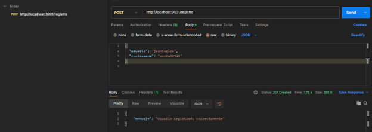
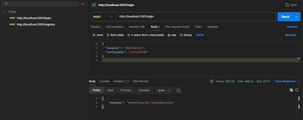

# API-autenticación
Servicio de API desarrollada usando Nodejs y Express que permite registrar un usuario en la base de datos y realizar la autenticación.

* Servidor Local
    - XAMPP
     
* Base de Datos
    - MySQL Workbench
     
* Herramienta de pruebas
    - Postman

<h5 align='center'>Registrar usuario</h5>

    

<h5 align='center'>Autenticación de  usuario</h5>

    

